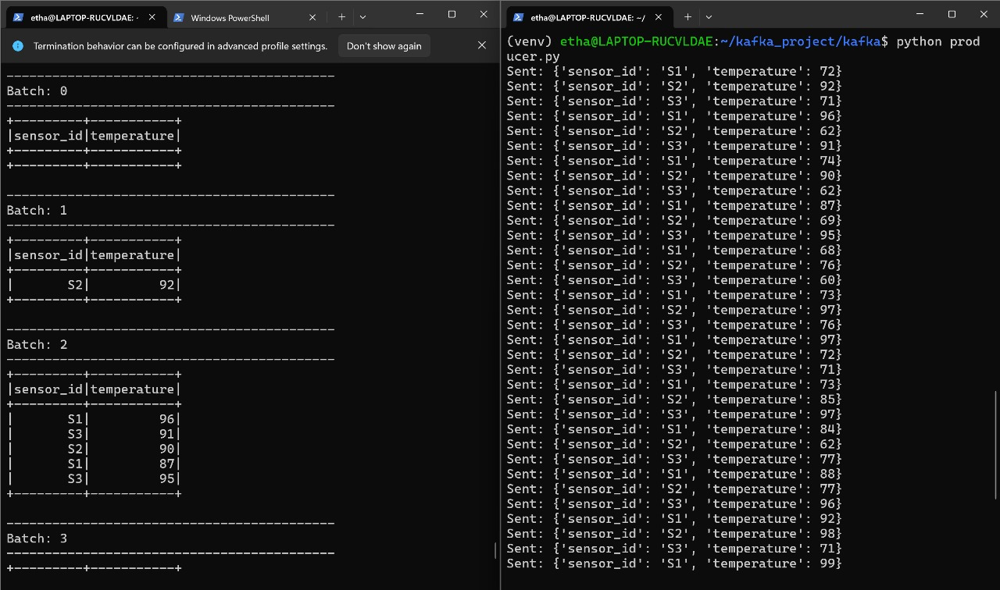

# Studi Kasus Apache Kafka
## Big Data

| Nama                       | NRP         |
|----------------------------|-------------|
| Etha Felisya Br Purba      | 5027221017  |
| Salsabila Amalia Harjanto  | 5027221023  |

## Latar Belakang Masalah
Sebuah pabrik memiliki beberapa mesin yang dilengkapi dengan sensor suhu. Data suhu dari setiap mesin perlu dipantau secara real-time untuk mencegah overheating yang dapat merusak peralatan dan mengganggu operasional. Setiap sensor akan mengirimkan data suhu setiap detik, sehingga pabrik membutuhkan sistem yang mampu mengumpulkan, menyimpan, dan menganalisis data suhu ini secara efisien.

## Studi Kasus Sederhana
Pabrik membutuhkan aliran data sensor yang dapat diteruskan ke layanan analitik atau dashboard secara langsung. Untuk keperluan ini, **Apache Kafka** digunakan untuk menerima dan mengalirkan data suhu secara real-time, sementara **PySpark** digunakan untuk mengolah dan memfilter data tersebut.

## Tugas

1. **Membuat Topik Kafka untuk Data Suhu**:
   - Buat topik di Apache Kafka bernama `"sensor-suhu"` yang akan menerima data suhu dari sensor-sensor mesin.

2. **Simulasi Data Suhu dengan Producer**:
   - Buat producer sederhana yang mensimulasikan data suhu dari beberapa sensor mesin (misalnya, 3 sensor berbeda).
   - Setiap data suhu berisi **ID sensor** dan **suhu saat ini** (contoh: `sensor_id: S1, suhu: 70°C`).
   - Data dikirim setiap detik ke topik `"sensor-suhu"`.

3. **Konsumsi dan Olah Data dengan PySpark**:
   - Buat consumer di PySpark yang membaca data dari topik `"sensor-suhu"`.
   - Filter data suhu yang berada di atas 80°C, sebagai indikator suhu yang perlu diperhatikan.

4. **Output dan Analisis**:
   - Cetak data yang suhu-nya melebihi 80°C sebagai tanda peringatan sederhana di console.

## Hasil yang Diharapkan
Mahasiswa diharapkan dapat:

- Memahami dasar cara kerja **Apache Kafka** dalam menangani data stream dari sensor.
- Membuat **producer** dan **consumer** sederhana untuk mengalirkan dan menerima data sensor.
- Melakukan pengolahan data dasar di **PySpark** dengan mengkonsumsi data dari Kafka, serta memfilter data berdasarkan kondisi tertentu.

## Penyelesaian
### Instalasi dan Persiapan Lingkungan
1. **Instalasi WSL**  
   Jika belum terpasang, instal WSL di Windows:
   ```
   wsl --install
   ```
2. **Update Sistem**
   Jalankan update dan upgrade paket di dalam WSL:
   ```
   sudo apt update
   sudo apt upgrade
   ```
3. **Instalasi Java**
   Pastikan Java versi 11 sudah terpasang:
   ```
   java --version
   sudo apt install openjdk-11-jdk
   ```
5. **Instalasi Python dan Pip**
   Instal Python dan pip untuk manajemen paket:
   ```
   sudo apt install python3 python3-pip
   sudo apt install python3-venv

   ```
7. **Membuat Proyek Kafka**
   Buat direktori proyek Kafka:
   ```
   mkdir kafka_project
   cd kafka_project
   ```
9. **Membuat Virtual Environment**
    Buat dan aktifkan virtual environment:
   ```
   python3 -m venv venv
   source venv/bin/activate
   ```
11. **Instalasi Kafka dan PySpark**
    Instal kafka-python-ng dan pyspark di dalam environment:
    ```
    pip install kafka-python-ng
    pip install pyspark
    ```
13. **Verifikasi Java**
    Pastikan Java sudah terinstal dengan benar:
    ```
    java --version
    ```
15. **Membuat Direktori Kafka**
    Buat direktori kafka di dalam proyek:
    ```
    mkdir kafka
    cd kafka
    ```
17. **Buat Producer dan Consumer**
    Buat file untuk producer dan consumer:
    ```
    nano producer.py
    nano consumer.py
    ```

### Mengonfigurasi Kafka dengan Docker
1. **Menjalankan Docker Compose**
   Pastikan docker-compose.yml sudah dikonfigurasi, lalu jalankan:
   ```
   docker compose up -d
   ```
2. **Memeriksa Status Docker Compose**
   Verifikasi container berjalan dengan baik:
   ```
   docker-compose ps
   ```
4. **Membuat Topik Kafka**
   Buat topik Kafka bernama suhu2 dengan perintah berikut:
   ```
   docker exec -it kafka kafka-topics.sh --create --topic suhu2 --bootstrap-server localhost:9092 --partitions 1 --replication-factor 1
   ```

### Menjalankan Producer dan Consumer
1. **Menjalankan Producer**
   Kirim data suhu sensor melalui producer:
   ```
   python producer.py
   ```
3. **Menjalankan Consumer**
   ```
   python consumer.py
   ```
## Hasil Penyelesaian


   
